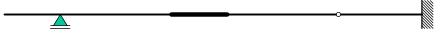

# Exam assignment 17 June 2026

You own submission can be found here: [ exam](https://ans.app/universities/1/courses/576087/assignments/1826427/go_to).

Given the following structure:

```{figure} ./2026_06_17_data/structure.svg
:align: center
:class: sticky-margin
:source: https://github.com/Structural-Mechanics-CEG/mechanics-figures-source/tree/main/exam_plasticity
:number:
```

:::::{exercise}
:label: exam_3_0
:nonumber: true

Draw the influence line for the vertical reaction force at $\rm{A}$ assuming a positieve reaction force acts upwards (↑). Show the exact value / jump value / kink value wherever it’s known without doing any calculations or indicate which unit loading situation leads to the influence line. The remainder of the graph can be drawn qualitatively. However, include clear indications of the direction of curvature, kinks and parts of the graph which are zero.

:::::

::::{admonition} Solution
:class: solution, dropdown

```{figure} ./2026_06_17_data/inf_line_Av.svg
:align: center
:source: https://github.com/Structural-Mechanics-CEG/mechanics-figures-source/tree/main/exam_plasticity
:number:
```

::::

:::::{exercise}
:label: exam_3_1
:nonumber: true

Draw the influence line for the vertical bending moment at $\rm{E}$ assuming a positieve bending moment has this deformation sign: ◠. Show the exact value / jump value / kink value wherever it’s known without doing any calculations or indicate which unit loading situation leads to the influence line. The remainder of the graph can be drawn qualitatively. However, include clear indications of the direction of curvature, kinks and parts of the graph which are zero.

:::::

::::{admonition} Solution
:class: solution, dropdown

```{figure} ./2026_06_17_data/inf_line_ME.svg
:align: center
:source: https://github.com/Structural-Mechanics-CEG/mechanics-figures-source/tree/main/exam_plasticity
:number:
```

::::

:::::{exercise}
:label: exam_3_2
:nonumber: true

Which two loading situations (the given structure with externally applied loads or torques, and/or externally applied displacements or rotations) allow you to calculate the value at $x = 10 \, \rm{m}$ of the influence line  for the vertical bending moment at $\rm{E}$? And what needs to be calculated in these loading situations to find the value of the influence line? You don't need to perform the calculations, just indicate what needs to be calculated based on which loading situation.

:::::

::::{admonition} Solution
:class: solution, dropdown

```{figure} ./2026_06_17_data/loading_1.svg
:align: center
:source: https://github.com/Structural-Mechanics-CEG/mechanics-figures-source/tree/main/exam_plasticity
:number:
```

```{figure} ./2026_06_17_data/loading_2.svg
:align: center
:source: https://github.com/Structural-Mechanics-CEG/mechanics-figures-source/tree/main/exam_plasticity
:number:
```

::::

:::::{exercise}
:label: exam_3_3
:nonumber: true

Draw the influence line for the rotation at $\rm{A}$ assuming a positieve rotation is counterclockwise (↺). Show the exact value / jump value / kink value wherever it’s known without doing any calculations or indicate which unit loading situation leads to the influence line. The remainder of the graph can be drawn qualitatively. However, include clear indications of the direction of curvature, kinks and parts of the graph which are zero.

:::::

::::{admonition} Solution
:class: solution, dropdown

```{figure} ./2026_06_17_data/inf_line_phiA.svg
:align: center
:source: https://github.com/Structural-Mechanics-CEG/mechanics-figures-source/tree/main/exam_plasticity
:number:
```

::::

:::::{exercise}
:label: exam_3_4
:nonumber: true

Which two loading situations (the given structure with externally applied loads or torques, and/or externally applied displacements or rotations) allow you to calculate the value at $x = 0 \, \rm{m}$ of the influence line for the rotation at $\rm{A}$? And what needs to be calculated in these loading situations to find the value of the influence line? You don't need to perform the calculations, just indicate what needs to be calculated based on which loading situation.

:::::

::::{admonition} Solution
:class: solution, dropdown

```{figure} ./2026_06_17_data/loading-3.svg
:align: center
:source: https://github.com/Structural-Mechanics-CEG/mechanics-figures-source/tree/main/exam_plasticity
:number:
```

```{figure} ./2026_06_17_data/loading-4.svg
:align: center
:source: https://github.com/Structural-Mechanics-CEG/mechanics-figures-source/tree/main/exam_plasticity
:number:
```

::::

:::::{exercise}
:label: exam_3_5
:nonumber: true

Given is the following influence line of an unknown force or displacement quantity at an unknown location on the structure:

```{figure} ./2026_06_17_data/inf_line_unknown.svg
:align: center
:source: https://github.com/Structural-Mechanics-CEG/mechanics-figures-source/tree/main/exam_plasticity
:number:
```

How can the structure be adapted in two different ways so that this influence line is a valid influence line for the structure? And for both of those two scenarios, for which force or displacement quantity at which location has the influence line been drawn?

:::::

::::{admonition} Solution
:class: solution, dropdown

```{figure-start}
:align: center
:source: https://github.com/Structural-Mechanics-CEG/mechanics-figures-source/tree/main/exam_plasticity
:number:
```

Influence line (support) bending moment at $\rm{C}$



```{figure-end}
```

```{figure-start}
:align: center
:source: https://github.com/Structural-Mechanics-CEG/mechanics-figures-source/tree/main/exam_plasticity
:number:
```

Influence line vertical support at $\rm{B}$.


```{figure-end}
```

::::