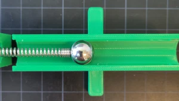
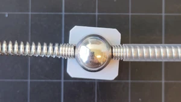

# Workshop virtuele arbeid

In deze workshop ga je de mechanismes die nodig zijn om virtuele arbeid toe te passen. Dat ga je doen met MOLA.

## Onderdelen
We maken gebruik van de volgende componenten
| MOLA    | Model |
| :--------: | :------: |
|   | |
| |   |
| |   |
|  | |
|  | |
|  | |

## Ligger op twee steunpunten
Laten we beginnen met een heel simpel model

```{figure} ./simply_supported/structure.svg
:width: 80%
:name: simply_supported
:align: center
Ligger op twee steunpunten
```

```{exercise} Ligger op twee steunpunten
:label: ss
:nonumber: true

Maak de ligger op twee steunpunten met MOLA
```

````{solution} ss
:class: dropdown

```{figure} ./simply_supported/structure.webp
:align: center
```

````

```{exercise} Linker verticale oplegging
:label: ss_A
:nonumber: true

Toon het mechanisme waarmee de oplegreactie in de linker verticale oplegging bepaald kan worden
```

```{exercise} Linker horizontale oplegging
:label: ss_Ah
:nonumber: true

Toon het mechanisme waarmee de oplegreactie in de linker horizontale oplegging bepaald kan worden
```

```{exercise} Rechter verticale oplegging
:label: ss_B
:nonumber: true

Toon het mechanisme waarmee de oplegreactie in de rechter verticale oplegging bepaald kan worden
```

```{exercise} Moment
:label: ss_M
:nonumber: true

Toon het mechanisme het moment halverwege de balk bepaald kan worden
```

## Scharnierligger
Laten we de complexiteit een beetje vergroten met de volgende scharnierligger:

```{figure} ./scharnierligger/scharnierligger.svg
:width: 80%
:name: simply_supported
:align: center
Scharnierligger
```

```{exercise} Scharnierligger steunpunten
:label: sl
:nonumber: true

Maak de ligger op drie steunpunten met MOLA
```

```{exercise} Linker verticale oplegging
:label: ss_A
:nonumber: true

Toon het mechanisme waarmee de oplegreactie in de linker verticale oplegging bepaald kan worden
```

```{exercise} Middelste verticale oplegging
:label: ss_B
:nonumber: true

Toon het mechanisme waarmee de oplegreactie in de middelste verticale oplegging bepaald kan worden
```

```{exercise} Rechter verticale oplegging
:label: ss_C
:nonumber: true

Toon het mechanisme waarmee de oplegreactie in de rechter verticale oplegging bepaald kan worden
```

```{exercise} Moment boven middelste oplegging
:label: ss_D
:nonumber: true

Toon het mechanisme waarmee het moment boven de middelste oplegging bepaald kan worden
```

```{exercise} Moment halverwege rechter overspanning
:label: ss_E
:nonumber: true

Toon het mechanisme waarmee het moment halverwege de rechter overspanning bepaald kan worden
```

```{exercise} Dwarskracht in scharnier
:label: ss_E
:nonumber: true

Toon het mechanisme waarmee de dwarskracht in het scharnier bepaald kan worden
```


## Ingeklemde scharnierligger
Laten we het probleem nog ietsje moeilijker maken, met een ingeklemde scharnierligger

```{figure} ./hinged_SD/structure.svg
:width: 80%
:name: hb_model
:align: center
Ingeklemde scharnierligger
```

```{exercise} Ingeklemde scharnierligger
:label: hb
:nonumber: true

Maak de ingeklemde scharnierligger met MOLA
```

```{solution} hb
:class: dropdown

```{figure} ./hinged_SD/structure.webp
:align: center
```

```

```{exercise} Verticale oplegging bij A
:label: hb_A
:nonumber: true

Toon het mechanisme waarmee de verticale oplegreactie in A bepaald kan worden
```

```{exercise} Oplegmoment bij A
:label: hb_Am
:nonumber: true

Toon het mechanisme waarmee het oplegmoment in A bepaald kan worden
```

```{exercise} Verticale oplegging bij B
:label: hb_B
:nonumber: true

Toon het mechanisme waarmee de verticale oplegreactie in B bepaald kan worden
```

```{exercise} Verticale oplegging bij B
:label: hb_B
:nonumber: true

Toon het mechanisme waarmee de verticale oplegreactie in C bepaald kan worden
```

```{exercise} Moment in D
:label: hb_MD
:nonumber: true

Toon het mechanisme waarmee het moment in D bepaald kan worden

```

```{exercise} Moment in B
:label: hb_MB
:nonumber: true

Toon het mechanisme waarmee het moment in B bepaald kan worden

```

```{exercise} Dwarskracht in D
:label: hb_MB
:nonumber: true

Toon het mechanisme waarmee de dwarskracht in D bepaald kan worden

```