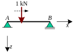

# MOLA exercise

In this exercise, you're going to find influence lines using MOLA. 

## Components
We'll use the following components:
| MOLA    | Model |
| :--------: | :------: |
|   | |
| |   |
| |   |
|  | |
|  | |
|  |  |
|  |  |

## Simply supported beam
Let's start with the most basic model, a simply supported beam:



```{exercise} Simply supported beam
:label: ss
:nonumber: true

Make the simply supported beam with MOLA
```

```{solution} ss
:class: dropdown


```

```{exercise} Influence line vertical support reaction at A for simply supported beam
:label: ss_A
:nonumber: true

Show the influence line of the vertical support reaction at A
```

```{solution} ss_A
:class: dropdown


```