# MOLA exercise

In this exercise, you're going to find influence lines using MOLA. It's meant to give you insight in when these influence lines have straight and/or curved parts. 

## Components
We'll use the following components:
| MOLA    | Model |
| :--------: | :------: |
|   | |
| |   |
| |   |
|  | |
|  | |
| 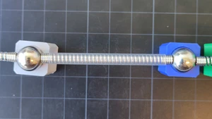 |  |
| 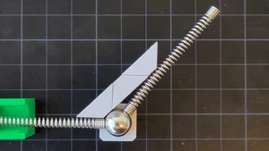 |  |

## Simply supported beam
Let's start with the most basic model, a simply supported beam:

```{figure} ./simply_supported/structure.svg
:width: 80%
:name: simply_supported
:align: center
Simply supported beam
```

```{exercise} Simply supported beam
:label: ss
:nonumber: true

Make the simply supported beam with MOLA
```

```{solution} ss
:class: dropdown

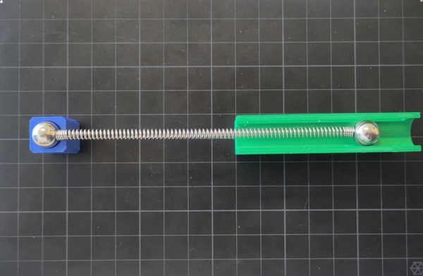

```

```{exercise} Influence line vertical support reaction at A for simply supported beam
:label: ss_A
:nonumber: true

Show the influence line of the vertical support reaction at A
```

```{solution} ss_A
:class: dropdown

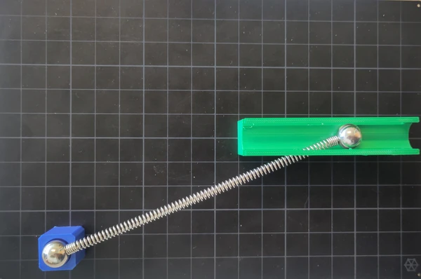

```

```{exercise} Influence line vertical support reaction at B for simply supported beam
:label: ss_B
:nonumber: true

Show the influence line of the vertical support reaction at B
```

```{solution} ss_B
:class: dropdown

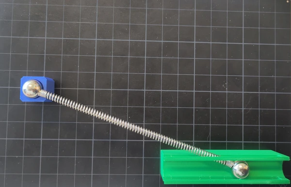

```

```{exercise} Influence line bending moment for simply supported beam
:label: ss_M
:nonumber: true

Show the influence line for the bending moment halfway the beam
```

```{solution} ss_M
:class: dropdown

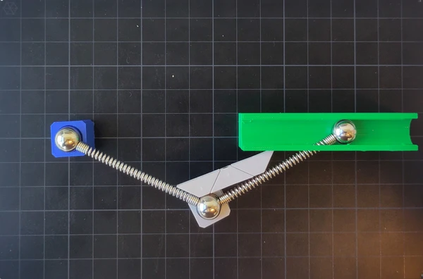

```

```{exercise} Influence line displacement for simply supported beam
:label: ss_w
:nonumber: true

Show the influence line for the displacement halfway the beam
```

```{solution} ss_w
:class: dropdown

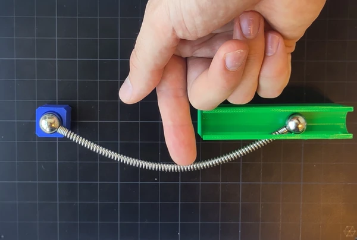

```

```{exercise} Influence line rotation for simply supported beam
:label: ss_phi
:nonumber: true

Show the influence line for the rotation halfway the beam
```

```{solution} ss_phi
:class: dropdown

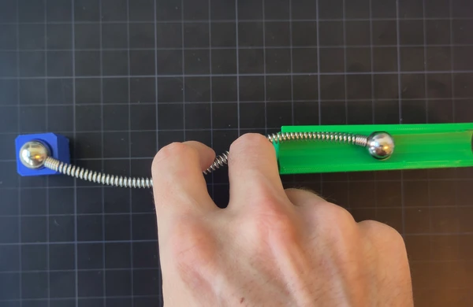

```

## Statically determinate hinged beam
Let's increase complexity a bit, by looking at a statically determinate hinged beam:

```{figure} ./hinged_SD/structure.svg
:width: 80%
:name: hb_model
:align: center
Statically determinate hinged beam
```

```{exercise} Statically determinate hinged beam
:label: hb
:nonumber: true

Make the statically determinate hinged beam with MOLA
```

```{solution} hb
:class: dropdown

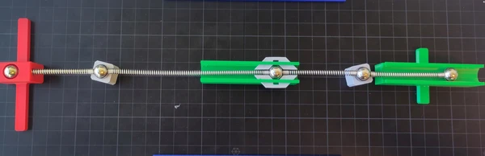

```

```{exercise} Influence line vertical support reaction at B for the statically determinate hinged beam
:label: hb_B
:nonumber: true

Show the influence line of the vertical support reaction at B
```

```{solution} hb_B
:class: dropdown

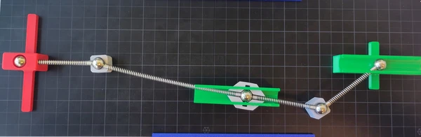
```

```{exercise} Influence line bending moment at D for the statically determinate hinged beam
:label: hb_MD
:nonumber: true

Show the influence line for the bending moment at D for the statically determinate hinged beam
```

```{solution} hb_MD
:class: dropdown

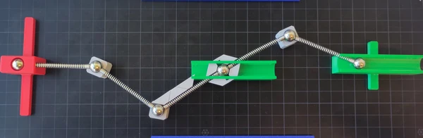

```

```{exercise} Influence line bending moment at B for the statically determinate hinged beam
:label: hb_MB
:nonumber: true

Show the influence line for the bending moment at B for the statically determinate hinged beam
```

```{solution} hb_MB
:class: dropdown

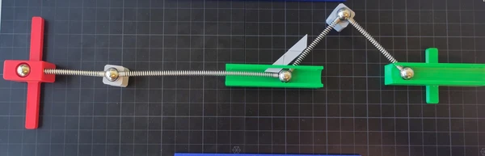

```

```{exercise} Influence line displacement in D for the statically determinate hinged beam
:label: hb_WD
:nonumber: true

Show the influence line for the displacement in D for the statically determinate hinged beam
```

```{solution} hb_WD
:class: dropdown

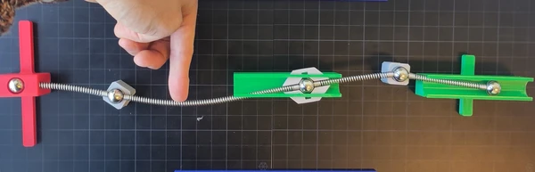
```

```{exercise} Influence line displacement in S2 for the statically determinate hinged beam
:label: hb_WS
:nonumber: true

Show the influence line for the displacement in S2 for the statically determinate hinged beam
```

```{solution} hb_WS
:class: dropdown

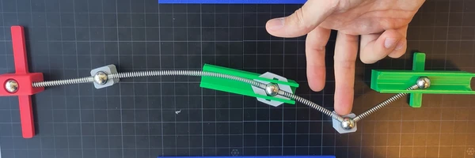
```

```{exercise} Influence line rotation in B for the statically determinate hinged beam
:label: hb_phiB
:nonumber: true

Show the influence line for the rotation in B for the statically determinate hinged beam
```

```{solution} hb_phiB
:class: dropdown

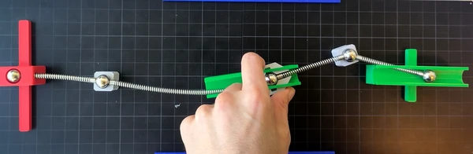
```

