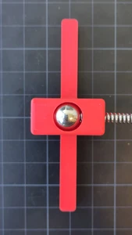
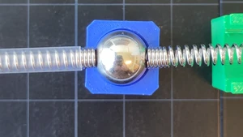
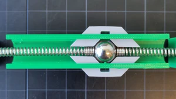
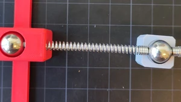

# Guided exercise 1

% bronbestanden heir: https://github.com/Tom-van-Woudenberg/mechanics-figures-source/tree/main/MOLA

In this exercise, you're going to find influence lines using MOLA. It's meant to give you insight in when these influence lines have straight and/or curved parts. 

## Components
We'll use the following components:
| MOLA    | Model |
| :--------: | :------: |
|   | |
| |   |
| |   |
|  | |
|  | |
|  |  |
|  |  |

Let's start with the most basic model, a simply supported beam:

```{figure} ./simply_supported/structure.svg
:align: center
:source: https://github.com/Tom-van-Woudenberg/mechanics-figures-source/tree/main/MOLA
:number:
```

```{exercise}
:label: ss
:nonumber: true

Make the simply supported beam with MOLA
```

````{admonition} Solution
:class: solution, dropdown

```{figure} ./simply_supported/structure.webp
:align: center
:number:
```

````

```{exercise}
:label: ss_A
:nonumber: true

Show the influence line of the vertical support reaction at A
```

````{admonition} Solution
:class: solution, dropdown

```{figure} ./simply_supported/inf_A.webp
:align: center
:number:
```

````

```{exercise}
:label: ss_B
:nonumber: true

Show the influence line of the vertical support reaction at B
```

````{admonition} Solution
:class: solution, dropdown

```{figure} ./simply_supported/inf_B.webp
:align: center
:number:
```

````

```{exercise}
:label: ss_M
:nonumber: true

Show the influence line for the bending moment halfway the beam
```

````{admonition} Solution
:class: solution, dropdown
```{figure} ./simply_supported/inf_M.webp
:align: center
:number:
```

````

```{exercise}
:label: ss_w
:nonumber: true

Show the influence line for the displacement halfway the beam
```

````{admonition} Solution
:class: solution, dropdown

```{figure} ./simply_supported/inf_w.webp
:align: center
:number:
```

````

```{exercise}
:label: ss_phi
:nonumber: true

Show the influence line for the rotation halfway the beam
```

````{admonition} Solution
:class: solution, dropdown

```{figure} ./simply_supported/inf_phi.webp
:align: center
:number:
```

````
